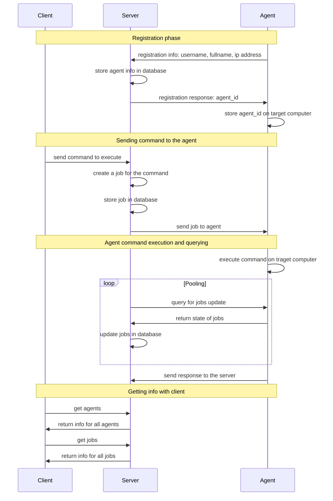

# R.A.T (Remote Access Tool)


> **⚠️ WARNING: This software is for educational purposes only. Misuse of this software may be illegal in your
jurisdiction. Use responsibly and only on systems you own or have explicit permission to access.**

R.A.T (Remote Access Tool) is a system that enables remote command execution on target systems. It allows operators to
securely execute shell commands on remote computers, phones, or IoT devices.

## Table of Contents

- [Features](#features)
- [Architecture](#architecture)
- [Prerequisites](#prerequisites)
- [Installation](#installation)
- [Usage](#usage)
- [Configuration](#configuration)
- [Troubleshooting](#troubleshooting)
- [Contributing](#contributing)
- [Security](#security)
- [References](#references)

## Features

- Remote shell command execution
- Agent auto-registration system
- Job queuing and management
- Real-time command output
- Cross-platform support

## Architecture

The system consists of three main components:

1. **Agent**: The client-side software that:

    - Runs on the target system
    - Handles command execution
    - Manages system registration
    - Reports execution results

2. **Server** (Command & Control):

    - Manages agent connections
    - Handles job distribution
    - Stores execution results
    - Provides API endpoints

3. **Client CLI**:
    - User interface for operators
    - Agent management
    - Job creation and monitoring
    - Result retrieval

### System Flow



## Prerequisites

- Rust toolchain (1.70 or later)
- Docker and Docker Compose
- PostgreSQL (if running without Docker)
- Make

## Installation

1. Clone the repository:

```bash
git clone https://github.com/yourusername/rat.git
cd rat
```

2. Build all components:

```bash
make build
```

3. Start the server (with Docker):

```bash
make docker
make compose
```

Alternative server setup (without Docker):

```bash
# Start PostgreSQL
# Configure environment variables (see Configuration section)
cargo run --release --bin server
```

4. Install the agent on target system:

```bash
cargo install --path agent
```

## Usage

### Starting the Agent

```bash
target/release/agent
```

### Client Commands

```bash
# List all registered agents
target/release/client agents

# View all jobs
target/release/client jobs

# Execute command on specific agent
target/release/client exec --agent <AGENT_ID> "<SHELL_COMMAND>"

# Get job result
target/release/client job --job <JOB_ID>
```

## Configuration

### Server Configuration

The server can be configured using environment variables:

- `DATABASE_URL`: PostgreSQL connection string
- `SERVER_PORT`: HTTP server port (default: 8080)
- `LOG_LEVEL`: Logging level (default: info)

### Agent Configuration

The agent stores its configuration in:

- Unix: ~/.rat_agent_id
- Windows: %USERPROFILE%/.rat_agent_id

## Troubleshooting

### Common Issues

1. **Agent can't connect to server**

    - Check if server is running
    - Verify network connectivity
    - Check firewall settings

2. **404 Not Found errors**

    - Ensure agent is properly registered
    - Verify agent ID is correct
    - Check API endpoint URLs

3. **Database connection issues**
    - Verify PostgreSQL is running
    - Check connection string
    - Ensure migrations are applied

## Contributing

1. Fork the repository
2. Create your feature branch
3. Make your changes
4. Submit a pull request

> ** Feel free to check the issues tab for inspiration.**

## Security

- All connections should be secured via HTTPS in production
- Implement proper authentication
- Use secure credential storage
- Regular security audits recommended

## References

- [Black Hat Rust](https://kerkour.com/black-hat-rust)
- [Remote Access Tools](https://www.fortinet.com/resources/cyberglossary/remote-access)
- [Rust Security Guidelines](https://anssi-fr.github.io/rust-guide/)
